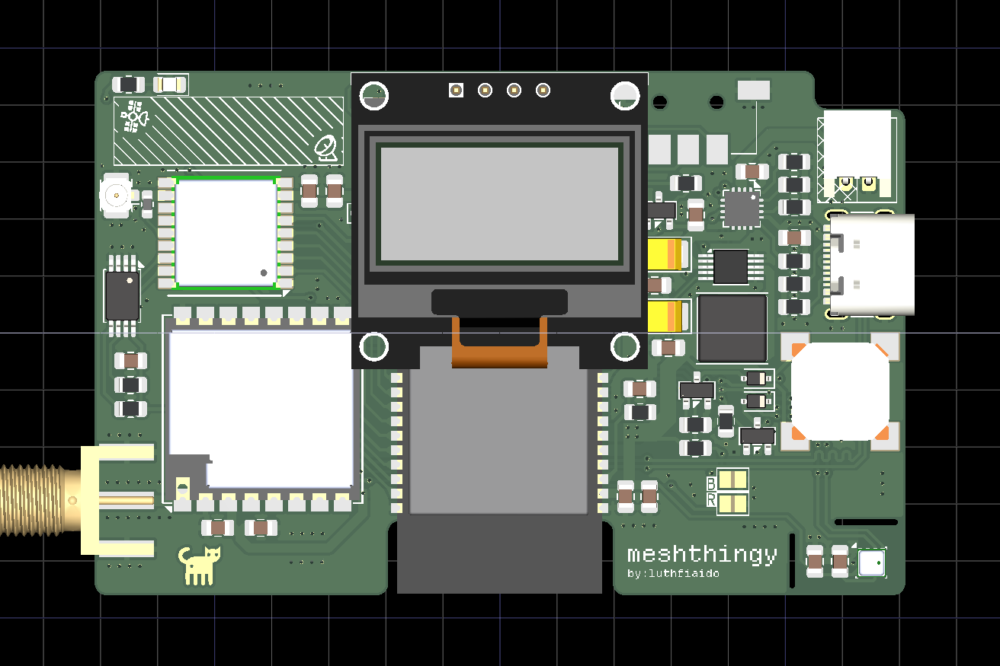
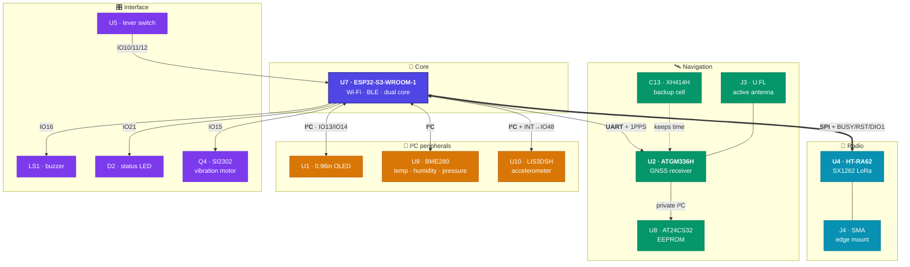
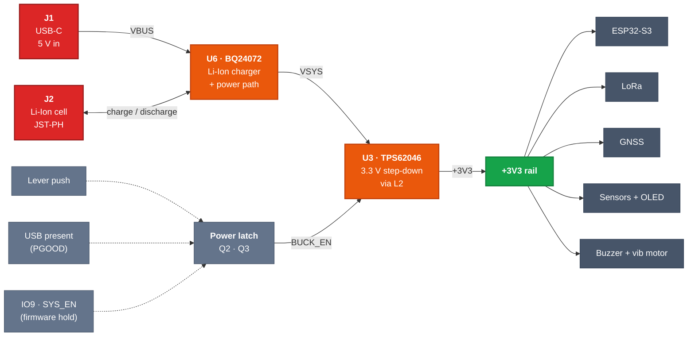
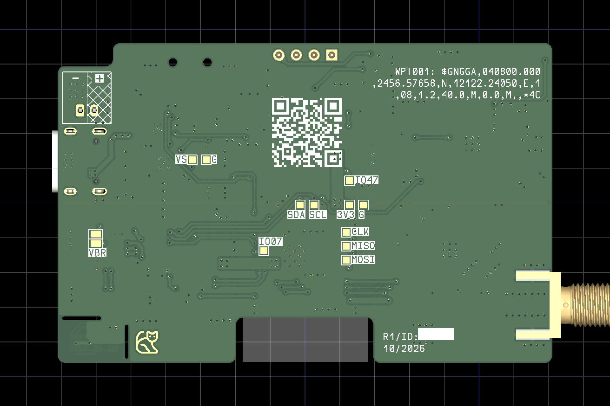
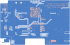

# meshthingy

> An off-grid LoRa mesh communicator — a pocket-sized ESP32-S3 node that sends
> text and GPS position over kilometres of open ground, with no cell tower, no
> SIM, no subscription, and no internet.

<sub>KiCad 10 · 2-layer · 71 × 46 mm · ESP32-S3 + SX1262 LoRa · USB-C · Li-Ion · hardware rev R1</sub>

<p align="center">
  
</p>

---

## What this board is for

Phones stop working the moment you leave coverage. **meshthingy** doesn't need
coverage — it *is* the network.

Each board is one node in a self-healing [Meshtastic](https://meshtastic.org)
mesh. Nodes talk directly to each other over licence-free LoRa radio, and every
node automatically relays traffic for its neighbours. Two units give you a
private long-range walkie-talkie for text; a handful scattered across a valley,
a campsite, a ridgeline, or a city block give everyone in that area a shared
messaging network that keeps working when nothing else does.

Because LoRa trades bandwidth for range and power, a node runs for **days** on a
small Li-Ion cell and reaches **several kilometres** line-of-sight — far past
Wi-Fi or Bluetooth, and without the power budget a cellular radio demands.

Typical uses: hiking and backcountry trips, sailing, off-road convoys, festival
and event crews, neighbourhood emergency preparedness, and as a low-cost
long-range telemetry link for remote sensors.

The onboard GPS, environmental and motion sensors mean a node is useful even
with nobody holding it — drop one on a hilltop as a solar-powered repeater and
it becomes a weather station that also extends everyone's range.

## Features

- **ESP32-S3-WROOM-1** — dual-core MCU with Wi-Fi and Bluetooth LE for phone pairing, native USB
- **HT-RA62 LoRa module** (SX1262) — long-range sub-GHz radio on an SMA edge-mount connector
- **ATGM336H GNSS** — position reporting on a U.FL active antenna, with a rechargeable backup cell for warm starts
- **0.96" OLED** — read messages without a phone
- **BME280** — temperature, humidity, barometric pressure, on a slotted island away from board heat
- **LIS3DSH accelerometer** — wake-on-motion and orientation, with interrupt to the MCU
- **USB-C charging** — BQ24072 Li-Ion charger with power-path, so it runs while charging
- **Soft power switch** — the lever's push turns the node on; firmware holds power and can turn itself off
- **JST-PH battery connector** — standard single-cell Li-Ion / LiPo, polarity marked on the silkscreen
- **Vibration motor driver** — SI2302 low-side switch with flyback diode, for silent alerts in a pocket
- **Buzzer, status LED, and a side lever switch** (CW / CCW / push) for headless operation
- **Test points** on every bus for bring-up and debugging

## System architecture



## Power path

USB-C and the battery both feed a power-path charger, so the node keeps running
while it charges and switches over seamlessly when USB is unplugged. The 3.3 V
buck converter is only enabled while something holds the power latch on.



### Turning on and off

The buck converter's enable is driven by a PNP switch (`Q2`) from a latch node
that is pulled low by any one of three sources, each isolated by a 1N4148WS:

1. **Lever push** (`U5`, `D7`) — pressing it powers the board up.
2. **USB present** (`PGOOD` from `U6`, `D4`) — the node is always on while plugged in.
3. **Firmware hold** (`IO9` / `SYS_EN` through `Q3`) — firmware must drive IO9 high
   early in boot, or the board switches off again when the lever is released.
   Driving IO9 low (with USB unplugged) powers the node down.

The MCU can read the lever push on `IO10` and USB presence on `IO17` (both through
diodes, active low, use internal pull-ups). The latch diodes must stay
low-leakage silicon parts — Schottkys leak enough to half-enable the buck when off.

### Charger settings (U6 · BQ24072)

| Setting | Part | Value |
| --- | --- | --- |
| Fast-charge current | `R4` = 1k (1%) | ≈ 890 mA |
| USB input current limit | `R5` = 1k2, EN2 = 1 / EN1 = 0 | ≈ 1.34 A |
| Safety timers | `R6` = 47k | pre-charge ≈ 38 min, fast charge ≈ 6.3 h |
| Termination | `TD` tied low | enabled |
| Battery temperature | `R3` = 10k fixed on `TS` | no thermistor, sensing disabled |
| Charge enable | `IO18` (`R7` pull-down) | low = charging allowed |

`VSYS` follows the battery (and tracks VBAT + 225 mV while charging). `IO8` reads
`VSYS / 2` through `R16`/`R17` — that is the battery voltage when running on battery.

## Board

| | |
| --- | --- |
| **Dimensions** | 71.0 × 46.0 mm, cut-out under the ESP32 antenna, milled slots isolating the BME280 |
| **Stackup** | 2 layers (F.Cu / B.Cu), 1.6 mm |
| **Components** | 96 footprints, 353 pads (329 SMD, 22 through-hole, 2 NPTH), 378 vias |
| **Density** | 67% front, 9% back — almost everything lives on the front |
| **Copper** | GND pour on both layers, pour cut back under the RF connectors and antennas |
| **Design rules** | 0.175 mm clearance, 0.2 mm minimum track, 0.6 / 0.3 mm vias |
| **Assembly** | SMD on the front, 0805 passives; through-hole only for `J2`, the OLED header and the USB-C shell tabs |

Everything routes on two layers, which keeps this a cheap board to order from any
prototype fab at standard tolerances.

### Assembled views

<table>
  <tr>
    <td width="50%" align="center">
      <br>
      <sub><b>Front</b> — LoRa and GNSS modules, ESP32-S3, USB-C, buzzer, GPS backup cell, motor driver</sub>
    </td>
    <td width="50%" align="center">
      <br>
      <sub><b>Back</b> — labelled test points for every bus, vibration motor pads (<code>JP1</code>), repo QR code</sub>
    </td>
  </tr>
</table>

### PCB layer views

Copper, silkscreen and board outline, plotted straight from the layout. The back
view is mirrored so its silkscreen reads the right way round.

<table>
  <tr>
    <td width="50%" align="center">
      <br>
      <sub><b>F.Cu + F.SilkS</b> — signal routing over the front ground pour; <code>B</code>/<code>R</code> are the boot and reset pads</sub>
    </td>
    <td width="50%" align="center">
      <br>
      <sub><b>B.Cu + B.SilkS</b> — mirrored; back pour with the test-point field and motor pads</sub>
    </td>
  </tr>
</table>

The RF section is deliberately sparse: the pours are cut back under the antenna
connectors, the ESP32's PCB antenna hangs over a board cut-out, and the GPS
keepout is marked on the silkscreen so nothing gets placed under it during assembly.

Regenerate these plots after any layout change:

```bash
kicad-cli pcb export svg --output docs/layers-front.svg \
  --layers "F.Cu,F.SilkS,Edge.Cuts" \
  --page-size-mode 2 --exclude-drawing-sheet --check-zones --mode-single \
  meshthingy.kicad_pcb

kicad-cli pcb export svg --output docs/layers-back.svg \
  --layers "B.Cu,B.SilkS,Edge.Cuts" --mirror \
  --page-size-mode 2 --exclude-drawing-sheet --check-zones --mode-single \
  meshthingy.kicad_pcb
```

## Pin map

| Function | ESP32-S3 pin | Goes to |
| --- | --- | --- |
| LoRa SCK | GPIO43 (TXD0) | `U4` pin 12 SCK |
| LoRa MOSI | IO1 | `U4` pin 14 MOSI |
| LoRa MISO | IO2 | `U4` pin 13 MISO |
| LoRa CS | IO6 | `U4` pin 15 NSS |
| LoRa DIO1 | IO4 | `U4` pin 6 (IRQ) |
| LoRa RESET | IO5 | `U4` pin 4 |
| LoRa BUSY | GPIO44 (RXD0) | `U4` pin 10 |
| GPS TX → MCU RX | IO42 | `U2` TXD |
| GPS RX ← MCU TX | IO41 | `U2` RXD |
| GPS 1PPS | IO40 | `U2` 1PPS |
| GPS reset | IO38 | `U2` nRESET |
| GPS on/off | IO39 | `U2` ON/OFF |
| I²C SDA / SCL | IO13 / IO14 | OLED (0x3C), BME280 (0x76), LIS3DSH (0x1D) |
| Accelerometer INT | IO48 | `U10` INT1 |
| Lever push | IO10 | `U5` push, via `D6` (active low) |
| Lever CCW / CW | IO11 / IO12 | `U5` (active low, 100 nF debounce) |
| Power hold | IO9 | `Q3` via `R9` — drive high to stay on |
| USB present | IO17 | `U6` PGOOD via `D3` (active low) |
| Charge enable | IO18 | `U6` CE (low = charge) |
| Battery sense | IO8 (ADC1_CH7) | `VSYS / 2` |
| Vibration motor | IO15 | `Q4` gate (10k pull-down `R23`) |
| Buzzer | IO16 | `Q1` gate (10k pull-down `R11`) |
| Status LED | IO21 | `D2` via `R22` |
| USB D− / D+ | IO19 / IO20 | `J1` (native USB) |
| Boot / reset | IO0 / EN | `B` / `R` pads |
| Spare / test | IO7, IO47 | back-side test points `IO07`, `IO47` |

IO3, IO35–37, IO45 and IO46 are left unconnected (strapping pins and the
octal-PSRAM pins on R8 module variants).

## Schematic layout

The design is hierarchical — root sheet [meshthingy.kicad_sch](meshthingy.kicad_sch):

| Sheet | Contents |
| --- | --- |
| [Power Management](Power%20Management.kicad_sch) | BQ24072 charger, TPS62046 buck, power latch, battery sense |
| [Microcontroller](Microcontroller.kicad_sch) | ESP32-S3-WROOM-1, boot and reset pads |
| [LORA](LORA.kicad_sch) | HT-RA62 module and SMA antenna path |
| [GPS](GPS.kicad_sch) | ATGM336H, U.FL antenna input, EEPROM, backup cell |
| [Display](Display.kicad_sch) | 0.96" OLED and its pinout-select jumpers |
| [Air Sensors](Air%20Sensors.kicad_sch) | BME280 |
| [Accelerometer](Accelerometer.kicad_sch) | LIS3DSH |
| [Peripherals](Peripherals.kicad_sch) | Buzzer and vibration motor drivers, status LED, test points |
| [Connectors](Connectors.kicad_sch) | USB-C receptacle, JST-PH battery |

## Bill of materials

The curated BOM is [bom/meshthingy-bom.csv](bom/meshthingy-bom.csv): 36 board
lines / 76 placed parts, plus the off-board items (battery, antennas, vibration
motor). It adds manufacturer part numbers where the footprint fixes the part,
and a notes column with ratings and the reason behind each value.

Still to pin down before ordering parts:

- `U7` — pick the module variant (e.g. `-N8R2`, `-N16R8`). Avoid the 1.8 V `…V`
  variants: IO47 and IO48 are in use.
- `C16`, `C25` — voltage rating (≥ 10 V low-ESR tantalum).
- `U4` — `HT-RA62-HF` for 863–928 MHz, `HT-RA62-LF` for 433/470 MHz.

Test points and solder jumpers are left out — they are PCB features, not parts.

## Building it

Open [meshthingy.kicad_pro](meshthingy.kicad_pro) in **KiCad 10** or newer.
All custom symbols and footprints live in [libs/](libs/) and are referenced through
`${KIPRJMOD}`, so the project is self-contained — clone and open, nothing else to install.

Generate fabrication files from the command line:

```bash
# Gerbers + drill, ready to zip and upload to a fab
kicad-cli pcb export gerbers --output fab/ meshthingy.kicad_pcb
kicad-cli pcb export drill   --output fab/ meshthingy.kicad_pcb

# Raw schematic BOM and pick-and-place
kicad-cli sch export bom       --output fab/bom-raw.csv meshthingy.kicad_sch
kicad-cli pcb export pos       --output fab/pos.csv meshthingy.kicad_pcb

# 3D render
kicad-cli pcb render --output board.png meshthingy.kicad_pcb
```

Generated outputs are gitignored — regenerate them, or attach them to a release tag.

### Assembly notes

`U3` (TPS62046) has a PowerPAD that must be soldered to the ground pad under it.
The pad is a copper shape on the board rather than part of the footprint, so it has
no paste aperture — tin it by hand, or add paste to the stencil, before reflowing U3.

`JP3` and `JP4` are three-way solder jumpers that select which OLED pin gets
`+3V3` and which gets `GND`, so the footprint accepts display modules with either
pinout. They ship **unbridged** — bridge them to match the module you source
before expecting the display to light up. Never bridge all three pads of one jumper.

`JP1` on the back is not a jumper. It's the pair of solder pads for the vibration
motor. Solder a coin or pager-style motor's leads across it: the pad on the
`+3V3` side takes the red lead and the pad on the `Q4` drain side takes the black
lead. `D9` clamps the motor's flyback, so the motor runs straight off the
`+3V3` rail.

`J2` has `+` / `−` marked on both sides. JST-PH battery leads are not wired the same
way by every vendor, and there is no reverse-polarity protection — check the plug
before connecting a cell.

`B` and `R` on the front are the **BOOT** and **RESET** pads. To put the ESP32-S3
into the ROM bootloader, short `B` while you tap `R`.

## Firmware

The board targets [Meshtastic](https://meshtastic.org) firmware on the ESP32-S3.
A starting point for a variant (check macro names against the firmware version
you build):

```c
#define USE_SX1262
#define LORA_SCK   43
#define LORA_MOSI  1
#define LORA_MISO  2
#define LORA_CS    6
#define LORA_RESET 5
#define LORA_DIO1  4
#define LORA_BUSY  44
#define SX126X_CS     LORA_CS
#define SX126X_DIO1   LORA_DIO1
#define SX126X_BUSY   LORA_BUSY
#define SX126X_RESET  LORA_RESET
#define SX126X_DIO2_AS_RF_SWITCH      // HT-RA62 drives its RF switch from DIO2
#define SX126X_DIO3_TCXO_VOLTAGE 1.8  // HT-RA62 TCXO is powered from DIO3

#define GPS_RX_PIN 42   // MCU RX  <- GPS TXD
#define GPS_TX_PIN 41   // MCU TX  -> GPS RXD
#define I2C_SDA    13
#define I2C_SCL    14
#define BATTERY_PIN 8
#define ADC_MULTIPLIER 2.0
```

Notes for a variant:

- **Power hold** — set `IO9` high as early as possible in boot; the board turns
  off when the lever is released otherwise.
- **Console on native USB** — LoRa SCK and BUSY sit on the UART0 pins (GPIO43/44),
  so build with USB CDC on boot and keep the serial console off UART0. The ROM
  boot log still toggles GPIO43 at reset; firmware resets the radio afterwards.
- **TCXO voltage** — 1.8 V is what Heltec uses on its SX1262 designs; confirm
  against the module if the radio fails to start.

The ESP32-S3 GPIO matrix means bus pins are remappable in firmware if a variant
config needs to differ.

## Repository notes

`.history/` is KiCad 10's Local History — a separate nested git repository of
autosaves. It is gitignored and should stay that way. Delete it freely if you
don't need the local undo history.

---

<sub>Meshtastic® is a registered trademark of Meshtastic LLC. This is an
independent hardware design and is not affiliated with or endorsed by Meshtastic LLC.</sub>
